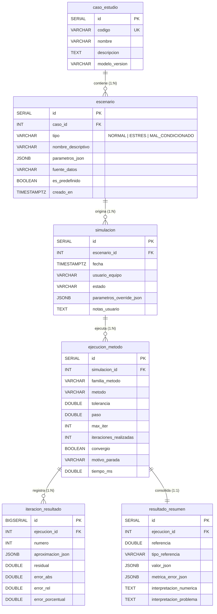

# Diagrama Entidad-Relación (DER Inicial) — SIMTELE-RISK

Este modelo relacional corresponde al esquema implementado en [database/schema.sql](../database/schema.sql) (PostgreSQL 16).

```mermaid
erDiagram
    caso_estudio ||--o{ escenario : "contiene (1:N)"
    escenario ||--o{ simulacion : "origina (1:N)"
    simulacion ||--o{ ejecucion_metodo : "ejecuta (1:N)"
    ejecucion_metodo ||--o{ iteracion_resultado : "registra (1:N)"
    ejecucion_metodo ||--|| resultado_resumen : "consolida (1:1)"

    caso_estudio {
        SERIAL id PK
        VARCHAR codigo UK
        VARCHAR nombre
        TEXT descripcion
        VARCHAR modelo_version
    }

    escenario {
        SERIAL id PK
        INT caso_id FK
        VARCHAR tipo "NORMAL | ESTRES | MAL_CONDICIONADO"
        VARCHAR nombre_descriptivo
        JSONB parametros_json
        VARCHAR fuente_datos
        BOOLEAN es_predefinido
        TIMESTAMPTZ creado_en
    }

    simulacion {
        SERIAL id PK
        INT escenario_id FK
        TIMESTAMPTZ fecha
        VARCHAR usuario_equipo
        VARCHAR estado
        JSONB parametros_override_json
        TEXT notas_usuario
    }

    ejecucion_metodo {
        SERIAL id PK
        INT simulacion_id FK
        VARCHAR familia_metodo
        VARCHAR metodo
        DOUBLE tolerancia
        DOUBLE paso
        INT max_iter
        INT iteraciones_realizadas
        BOOLEAN convergio
        VARCHAR motivo_parada
        DOUBLE tiempo_ms
    }

    iteracion_resultado {
        BIGSERIAL id PK
        INT ejecucion_id FK
        INT numero
        JSONB aproximacion_json
        DOUBLE residual
        DOUBLE error_abs
        DOUBLE error_rel
        DOUBLE error_porcentual
    }

    resultado_resumen {
        SERIAL id PK
        INT ejecucion_id FK
        DOUBLE referencia
        VARCHAR tipo_referencia
        JSONB valor_json
        JSONB metrica_error_json
        TEXT interpretacion_numerica
        TEXT interpretacion_problema
    }
```
